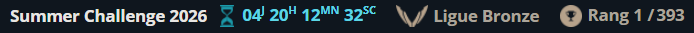
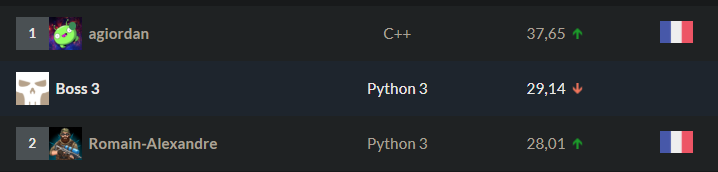

# codingame_back_track_king

CodinGame Summer Challenge 2026

## Chosen algorithm

### Recherche sur combinaisons (v4.0)

Chaque tour, le bot note tout le plateau, puis essaie **tous les coups qu'il
peut se payer** et garde celui qui laisse la meilleure position.

#### Les étapes du tour

1. Noter chaque case du plateau : combien vaudrait un rail posé là.
2. Repérer les régions où l'adversaire a le plus à perdre si on les encre.
3. Baisser la note des cases dont la région est près d'être encrée — un rail
   y vivrait peu.
4. Retenir les meilleures cases, celles qui méritent qu'on y réfléchisse.
5. En former tous les groupes de rails que les 3 peintures permettent
   d'acheter, du plus prometteur au moins prometteur.
6. Pour chaque groupe, et pour chaque région à encrer envisagée : imaginer le
   plateau qui en résulterait.
7. Noter ce plateau imaginé, et retenir le meilleur couple rails + encrage.
8. Jouer ce couple.

#### Ce qui compose la note d'une case

| # | terme | effet | condition |
|---|---|---|---|
| 1 | **bonus région-à-ville** | `+ (W+H)/4` | la région contient une ville — elle ne peut jamais être encrée, le rail n'y sera jamais effacé |
| 2 | **récompense de chemin** | `+ max(1, W+H − coût du chemin)`, **une fois par chemin** | la case est sur le plus court chemin d'un wish ; cumulatif si plusieurs s'y croisent |
| 3 | **remise d'encre** | `× (5 − instabilité)` | par région, instabilité plafonnée à 4 : une région proche de l'encre porte des rails bientôt effacés |
| 4 | **diffusion** | `+` moitié de chaque voisine valuée, sommée | uniquement sur les cases restées à 0, et seulement s'il reste de la peinture sans case à acheter |

Le terme 2 est le moteur : une liaison courte vaut plus qu'une longue, parce
que c'est celle qu'un tour peut finir. « Courte » se compte **en peinture, pas
en cases** : l'arbitre note bien une liaison au nombre de cases, mais ce A*
choisit où dépenser nos 3 points du tour, et une montagne en coûte vraiment 3.
Mesurer l'inverse a coûté 20 points de winrate (v3.11, abandonnée).

#### Comment un plateau imaginé est noté

`différence de liaisons × 10000 + somme des notes des cases achetées`

Une liaison terminée vaut donc plus que n'importe quelle somme de notes : finir
une liaison passe toujours avant accumuler du bon terrain. La différence se
compte sur **les deux joueurs**, donc couper une liaison adverse rapporte
autant qu'en finir une.

C'est ce qui remplace le veto de v3.10 : une coupe qui casse plus de nos
liaisons que des siennes se note mal toute seule, sans règle dédiée.

**Un encrage est gratuit**, donc il est pris dès que le plateau est *à
égalité* — jamais au-dessus d'un vrai gain. Sans cette règle v4.0 ne jouait
**aucun encrage de la partie** : la note ne voit que la liaison coupée
aujourd'hui, jamais l'instabilité qui encrera la région plus tard.

#### Ce qui départage deux cases de même note

L'égalité est le cas normal : un chemin récompense toutes ses cases à
l'identique. Dans l'ordre : la note, puis l'adjacence au réseau déjà posé,
puis le terrain le moins cher, puis l'ordre de balayage pour rester
déterministe.

**L'adjacence est plus faible qu'en v3.10, sciemment.** Le greedy reclassait
entre chaque rail : le 2ᵉ voyait le 1ᵉʳ comme du réseau. La recherche doit
former ses groupes avant de les juger, donc aucune case candidate ne voit les
autres. La note ne rattrape la contiguïté que lorsqu'elle **termine une
liaison** : trois rails alignés qui n'en terminent aucune valent autant que
trois rails éparpillés de même note.

Mesuré sur 100 tours : **39 % des rails d'un tour touchent un autre rail du
même tour, contre 42 % en v3.10**. L'écart est faible parce que la recherche
pose plus de rails (236 contre 218) — elle voit les groupes qui tiennent dans
3 peintures, là où le greedy s'enfermait en prenant une montagne à 3 en
premier.

Piste pour le rétablir : compter l'adjacence interne au groupe au moment de
noter, sous la somme des notes.

#### Trois règles apprises à la dure

**Ne jamais diffuser la carte que les rails classent.** Essayé en v3.2 : le
halo remonte une montagne collée au couloir au-dessus d'une plaine plus loin
sur ce même couloir, et **58 tours sur 100 passaient les 3 peintures dans une
seule montagne**. 4 V – 116 D contre v3.1. D'où la copie pour le DISRUPT.

**Le sens du parcours compte.** L'A* départage NESW en marchant depuis la
source, et ne réécrit un parent que sur une amélioration stricte : partir de B
au lieu de A donne un autre couloir sur **3,8 % des paires**. D'où
l'orientation de l'arbitre conservée telle quelle.

**La diffusion remplit la fin de partie.** Les plus courts chemins sont bâtis
bien avant la fin : sans elle, **65 tours sur 100 étaient des `WAIT`** et le
bot posait 86 rails ; avec, zéro `WAIT` et 190 rails.

## Debug viewer

`tools/` contient une interface qui affiche la map et **la valeur que
l'algorithme a donnée à chaque case** ce tour-là — exactement le nombre sur
lequel le coup a été lu. Un tour = une seule carte (le planner note tout le
plateau d'un coup), donc plus de rounds ni de préfixes à sélectionner.

`main.cpp` reste compilable et jouable seul — c'est `make check` qui le
garantit, et le binaire de compétition est inchangé au bit près (les hooks
sont des macros vides hors `DEBUG_TOOL`).

Sur le plateau :

- **heatmap + chiffre** dans chaque case jouable : la valeur finale, après la
  remise d'encre. Les zéros sont laissés vides, ils sont la majorité.
- **anneaux blancs numérotés** sur les rails posés ce tour, dans l'ordre où le
  planner les a choisis.
- **contour orange** autour de la région DISRUPT.
- le panneau latéral classe les régions encrables par score de disrupt, et le
  survol d'une case donne sa valeur, sa région et son score.

Contrairement au beam, **le planner est déterministe** : il ne s'arrête pas
sur l'horloge. Rejouer le même log avec le même binaire donne exactement la
même sortie, et un replay qui diffère du log veut dire que le log a été écrit
par une autre version du bot.

```sh
make replay LOG=.colosseum/logs/firstenv/run-*/game_*_p0.events.jsonl
make viewer     # puis http://localhost:8000
```

### Observer un bot précis

Jouer la partie en la logguant, rejouer le log, servir le viewer :

```sh
cg-colosseum battle v4.0 v3.10 -n 1 --seed 42 -l .colosseum/logs/v3_comp/mine
make replay LOG=.colosseum/logs/v3_comp/mine/game_*_p0.events.jsonl
make viewer
```

Chaque partie écrit **deux logs, un par joueur** : `_p0` est le premier bot
cité, `_p1` le second. C'est ce suffixe qui choisit le bot observé, pas
l'ordre des arguments de `replay`.

Attention : le log ne contient que ce que l'arbitre a envoyé à ce joueur, et
`make replay` le rejoue dans le `main.cpp` **compilé maintenant**. Pour voir
jouer une ancienne version il faut donc aussi restaurer son `main.cpp` ;
sinon on regarde la version courante rejouer les situations que l'ancienne a
rencontrées — utile pour comparer deux versions sur les mêmes plateaux, mais
c'est un autre usage.

### Commandes du Makefile

| commande | effet |
|---|---|
| `make` / `make play` | compile `main.cpp` seul → `a.out` (le binaire de compétition) |
| `make check` | vérifie que `main.cpp` compile sans l'outil — le garde-fou de la contrainte |
| `make debug` | construit `tools/btk-debug`, uniquement si `main.cpp` ou `debug_tool.cpp` ont changé |
| `make replay LOG=<jsonl>` | construit l'outil si besoin, vide les anciens dumps, puis rejoue la partie |
| `make viewer` | sert l'interface sur `http://localhost:8000` |
| `make clean` | supprime `a.out` et `tools/btk-debug` |

Variables : `LOG` (obligatoire pour `replay`), `TURNS` (défaut 100, plafonné à
la longueur de la partie), `DUMPS` (défaut `tools/dumps`), `PORT` (défaut 8000).

```sh
make replay LOG=<jsonl> TURNS=30     # s'arrêter au tour 30
make viewer PORT=8080                # si le port est déjà pris
```

`replay` efface `tools/dumps/turn_*.json` avant de rejouer : sans ça, une
partie plus courte laisserait derrière elle la fin de la précédente, et le
viewer listerait ces tours comme s'ils appartenaient à la nouvelle.

Sous WSL, un navigateur Windows n'atteint pas le `localhost` de la distro :
`serve.py` affiche au démarrage la seconde adresse (`http://172.x.x.x:8000/`)
qui, elle, fonctionne depuis Chrome. Le terminal intégré de VSCode redirige le
port tout seul, d'où `localhost` qui y marche.

### Images de tuiles (optionnel)

Déposer des PNG carrés dans `tools/tiles/` remplace les cases de couleur :

| fichier | remplace |
|---|---|
| `plains.png` `river.png` `mountain.png` | le terrain |
| `town.png` | les villes (l'id reste écrit par-dessus) |
| `inked.png` | les régions encrées |
| `rail_me.png` `rail_foe.png` `rail_neutral.png` | les pastilles de rail |

Tout est facultatif et indépendant : un fichier manquant retombe sur sa
couleur, donc un jeu partiel fonctionne. Les images n'ont pas besoin d'être
à la même taille — chacune est redimensionnée à la case (30 px). La couleur
du terrain est peinte dessous, donc une image à fond transparent se pose sur
sa teinte plutôt que sur du vide. Dès qu'une image est présente, la heatmap
passe en translucide (0.65) pour la laisser voir, et les chiffres prennent un
contour noir pour rester lisibles sur n'importe quel fond.

`tools/tiles/` est dans `.gitignore` — retirer la ligne pour versionner tes
images.

### Fichiers

- `tools/debug_tool.cpp` — `#include "../main.cpp"`, donc c'est le vrai moteur
  qui est observé, jamais une réimplémentation.
- `tools/serve.py` — sert le viewer et les dumps (stdlib seule).
- `tools/viewer.html` — Canvas : terrain, régions, rails, villes, encre, et la
  carte des valeurs.

Mode live : `./tools/btk-debug live tools/dumps` se comporte comme le bot
(stdin/stdout) et dépose un dump par tour à côté. Utilisable directement comme
bot dans `colosseum.toml`, avec le bouton *Live* du viewer pour suivre.

## Idées à essayer

- diffusion : Ajouter 4 moitiés sur un case donne un score plus grand que les cases elles mêmes. Il faut ajouter 1/4 ? Est ce qu'on veut que ces cases puissent être meilleur que d'des principales a* ?
- Est ce que le choix résultant des 24 meilleurs combinaisons tombe souvent sur les 3/4 premiers ?
    - Si oui, alors on peut réduire la PRUNING_WIDTH à 10 -> OUI IL SEMBLERAIT. 
    - Si non, alors il faudrait la laisser élevé
- Moins punir les cases inked
- Use partOfActiveConnections:
  Une chaîne de paires townId séparées par des virgules indiquant que cette case fait partie d’une connexion active entre ces deux villes.
  ex. " 1-2,1-3,4-7 ": la case fait partie du chemin le plus court entre les villes 1 & 2, villes 1 & 3, et villes 4 & 7.
  " x " si cette case ne fait partie d’aucune connexion active.

## Idées pour le prochain algorithm : Beam search with pruning algorithm and heuristic

Lorsqu'on mettra un beam search par dessus, on pourrait faire des depth entre les tours pour choisir quelle région à disrupt parmis les 3 meilleurs. Faire une depth séciale pour les DISRUPT :
- Pruning comme avant pour avoir les disruptPruningWidth meilleurs régions à supprimer
- On obtient Bwidth x disruptPruningWidth états
- Sur une copie de chaque état, supprimer entierement la région pour l'heuristic UNIQUEMENT (PROBLEME : ne favorise pas le passage de 4 à 5 par rapport de 0 à 1)
- Appliquer l'heuristic pour choisir les Bwidth meilleurs état
- ink de 1 sur chaque Bwidth vrai état

On peut commencer avec PRUNING_WIDTH=10 (branching factor)

### Idées de l'époque encore valables

- Une lookup table de `path` entre 2 cases (distance A* + liste des régions
  traversées), plus un index inverse région → chemins, pour ne recalculer que
  les chemins invalidés quand une région est encrée. `PathTable` faisait ça en
  v2.x ; le planner v3 recalcule tout, ce qui coûte moins cher que le cache à
  cette taille de plateau.

## Protocole de mesure

**Ne jamais comparer deux candidats l'un contre l'autre.** Le planner est
déterministe : deux versions proches visent la même case au même tour, le
moteur marque le rail `NEUTRAL_OWNER`, personne ne le possède, aucune
connexion ne paie. **v3.4 contre lui-même donne 0-0 systématiquement.**

Le duel v3.8 vs v3.4 a ainsi rendu 636 nulles sur 930 et un verdict de 0,0 %,
alors que v3.8 vaut 94,1 % contre un adversaire tiers. Le biais est d'autant
plus fort que les deux versions se ressemblent, donc il frappe exactement les
comparaisons qu'on veut faire.

Le bon protocole : **les deux candidats contre un même adversaire tiers**, et
on compare les deux taux.

**Mais le nul n'est un risque que si les deux versions se ressemblent.** Le
diagnostic est le **nombre de nulles**, pas le principe du duel : v4.0 contre
v3.10 en a rendu **1 sur 600**, là où deux quasi-jumeaux en rendaient 636 sur
930. Quand les deux bots jouent vraiment différemment, le duel direct est
valide — et c'est lui qui renseigne.

**v3.1 est saturé, ne plus s'en servir pour départager.** Les trois versions
ci-dessous sont indiscernables face à lui :

| candidat | contre v3.1 |
|---|---|
| v3.4 | 96,7 % (94,9–97,8) |
| v3.10 | 96,8 % (95,1–97,9) |
| v4.0 | 96,7 % (94,9–97,8) |

Or v4.0 bat v3.10 à **78,7 %** en direct. À ~97 % il ne reste qu'une vingtaine
de parties pour discriminer : l'intervalle de confiance est plus large que
l'écart qu'on cherche. Mesurer **contre la version en place**, et n'utiliser un
tiers que si les nulles montent.

```sh
cg-colosseum compare <candidat>  v3.1 -n 300 -s -t 8 --no-log
cg-colosseum compare <reference> v3.1 -n 300 -s -t 8 --no-log
```

Signal d'alarme : un taux de nulles élevé, ou un verdict extrême (0 %, 100 %)
sans nulles du côté opposé, veut dire que la mesure est cassée, pas que le bot
l'est.

## Versions

### v4.0

Remplace le greedy par une **recherche sur combinaisons**. Toutes les
combinaisons de rails de coût ≤ 3 tirées des 24 meilleures cases, contre le
plateau sans DISRUPT et les 4 meilleures régions ; heuristique
`différence de score × 10000 + somme des valeurs`.

**78,7 % contre v3.10** (75,2–81,8 %, 600 games) — premier gain net depuis
v3.4. Le greedy posait 229 rails par partie, la recherche 246, et 38 tours sur
100 changent de jeu de rails.

Le veto de v3.10 est supprimé (redondant avec la différence de score). Une
règle a dû être ajoutée : prendre un DISRUPT à égalité de plateau, sans quoi
l'heuristique un-tour n'en joue aucun.

Last moment in arena: -

First moment in arena: 333/1439 overall & Silver league

### v3.11 — abandonnée (significativement pire)

Le A* ne pondérait plus les cases par leur coût de peinture : chaque case
passable coûtait 1, au motif que l'arbitre note une liaison au **nombre de
cases**. Divergence bien réelle (3775 paires hors jeu : 84,5 % des trajets
changent, 20,3 % étaient plus longs que nécessaire en cases, 2,6 cases de
moyenne), mais **29,8 % de winrate contre v3.10** (26,3–33,6 %, 600 games).

Leçon : ce A* ne prédit pas le score de l'adversaire, il décide où poser notre
peinture. Un chemin court en cases qui franchit deux montagnes coûte deux tours
pleins — le coût terrain était donc le bon critère pour la question réellement
tranchée ici : quel tracé on a les moyens de finir.

### v3.10

Vérifie que les région que l'on veut DISRUPT ne participent pas à des chemins qui me rapportent plus de points qu'à l'adversaire

Last moment in arena: 412/1468 overall & Silver league

First moment in arena: 315/1439 overall & Silver league

### v3.9 — abandonnée (non concluante)

`partOfActiveConnections` agrégé par case en un simple compteur
(`Map::activeConnCount`, rempli pendant le parsing existant), utilisé
uniquement par `chooseDisrupt` : chaque rail y compte
`valeur * (1 + 2 * traversées)`, des deux côtés de la soustraction — un rail
actif rapporte à son propriétaire chaque tour, le nôtre autant.

Mesuré contre v3.1 : **96,3 %** (94,6–97,6) contre **96,7 %** (94,9–97,8) pour
v3.4. Intervalles quasi superposés, **aucun écart démontré**.

Le signal est pourtant bien réel (vérifié sur log : 14 à 46 traversées par tour
dès le tour 1). L'enseignement est donc sur le levier, pas sur l'implémentation :
**changer la cible du DISRUPT ne déplace pas le résultat**. Le plafond est dans
le placement des rails.

Limite de mesure à retenir : à 96 % contre v3.1, il ne reste qu'une vingtaine de
défaites pour départager deux candidats — le bruit domine. Départager mieux que
v3.4 demanderait un adversaire tiers plus fort, et l'environnement n'en contient
pas (v3.0 est plus faible, v3.5→v3.8 sont des régressions).

### v3.8 — abandonnée

`partOfActiveConnections` exploité par case : une case vide sur un chemin
payant vaut ce qu'elle rapporterait par tour, doublé si elle jouxte un rail
adverse payant. Mesuré contre v3.1 : **94,1 %** contre **96,7 %** pour v3.4.
N'apporte rien avec `INCOME_WEIGHT = 12`, le seul poids essayé.

### v3.7 — abandonnée

Mélange des deux routes : terrain (ligne long terme, poids 3) + réseau (rails
gratuits, poids `1 + 24/restant`). 37,3 % contre v3.4 — mais mesuré avec le
protocole biaisé, donc à reprendre si l'idée est relancée. Défaut constaté :
99 % de la valeur se déposait sur des cases injouables.

### v3.6 — abandonnée

Ne payer que les cases vides du chemin. 1,6 % contre v3.4, chiffre lui aussi
suspect (protocole biaisé). Enseignement retenu : les cases déjà railées
portent la mémoire du tracé d'un tour sur l'autre.

### v3.4



L'A* part de la ville demandeuse, et non de celle au plus petit id. Le tri par
id dans `init` annulait le départage NESW sur ~3,8 % des paires ; il ne
dédupliquait rien, aucun wish n'étant déclaré deux fois.

Last moment in arena: 354/1435 overall & Silver league

First moment in arena: 801/1435 -> 354/1435 overall & Silver league

Bronze submit: 99 WIN / 2 LOSES



### v3.3

Diffuse la valeurs des cases seulement pour la selection du DISRUPT.
Battle locale contre v3.1 (120 parties, positions échangées) : **118 V – 2 D**.

### v3.2 — abandonnée

Diffuse la valeurs des cases tout le temps.
Problème : Les cases "évité" comme les montagne ayant 3 voisins héritent de plusieurs cases voisines et biaise les stats.

### v3.1

Diffusion des valeurs quand le tour ne peut plus rien poser : les cases à zéro
prennent la moitié de chaque voisine valuée. 65 tours `WAIT` sur 100 → 0, et
86 rails posés → 190, pour ~36 µs par tour.

Battle locale contre v3.0 (119 parties valides, positions échangées) :
**109 V – 0 D – 10 nulles**. v3.0 ne gagne aucune partie.

### v3.0

Greedy sans recherche : une carte de valeurs par tour, les rails sur les
meilleures cases abordables. ~100 µs par tour au lieu de 30 ms.

Battle locale contre v2.8 (121 parties, positions échangées) : **92.9 % — 7.1 %**.

### v2.8

Reduce main beam width and nested beam on future depths

### v2.7

Replace whish data strcuture by a uint64 bit mask

### v2.6

Sort indexes and corresponding evaluation instead of full beam nodes

### v2.5

Split Map class into mutable + shared-immutable classes, reducing a lot the beam node structure manipulation/copy

### v2.4

Reduce structure byte size

### v2.3

Try nested beam search heuristic improvments

### v2.2

Infinite 'WAIT' turns bug resolved by finding the best non empty action when first beam depth is broken

Last moment in arena: 810/1435 overall & Bronze league

First moment in arena: 676/1320 overall & Bronze league

### v2.1

Reduce time budget from 45ms to 30ms : No remaining timeouts
But many games are lost because of infinite WAIT action trhown each turn...

Last moment in arena: 708/1316 overall & Bronze league

First moment in arena: 100/400 Bronze

### v2.0

Nested beam searches: an outer one plans turns ahead, and for each of its
nodes an inner one decides that turn's rails one cell at a time. Both are
interruptible, playing the best line found when the turn budget runs out.

- Rail placement: every affordable cell touching the network, scored by how
    much it shortens the remaining wishes.
- Turn scoring (extendGap): per wish, the terrain distance from a newly
    laid cell to whichever of its two towns is farther.
- State scoring (evaluate): income difference per turn, minus GAP_PENALTY
    per cell of true remaining gap, from one multi-source flood fill
    (openGapTotal) that reads off where two components' floods meet.
- Disrupt choice: the region where the opponent owns the most connection
    rails more than we do. Four disrupts ink a region and erase its rails.

Last moment in arena: 230/450 Bronze

First moment in arena: 191/558 Bronze

### v1.0

- Find shortest distance amongs desired connections to build
- Skip connection if active
- Pick which region to disrupt: one with enemy rails, not yet inked,
    not containing one of our/their towns (can't disrupt those),
    preferring the one closest to being inked / with the most rails

Last moment in arena: 580/115 Bronze

First moment in arena: 191/558 Bronze

### v0.2

Last moment in arena: 320/558 Bronze

First moment in arena: -
